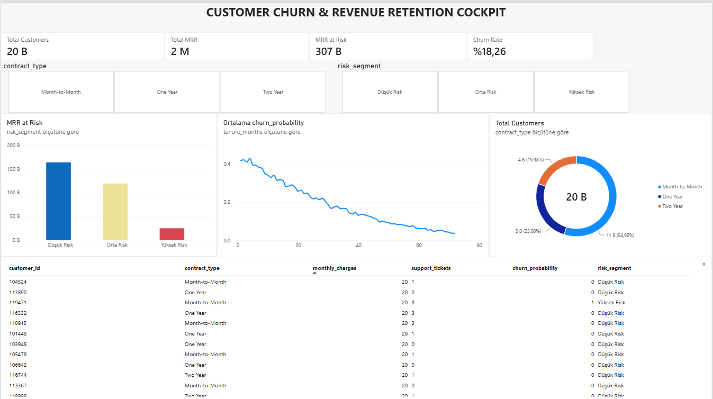

# Customer Churn & Revenue Retention Analytics Cockpit



An end-to-end B2B/B2C Customer Churn & Revenue Retention Analytics Cockpit built with Python (data generation & probability modeling) and Power BI (DAX, Power Query & financial risk segmentation).

---

## 📌 Executive Summary
Customer churn poses a direct threat to predictable Monthly Recurring Revenue (MRR). This cockpit enables commercial and customer success teams to:
* Track financial exposure across contract lifecycles.
* Isolate churn probability patterns across customer tenure.
* Prioritize high-value accounts at immediate risk through dynamic risk segmentation.

---

## 🎯 Key Metrics & DAX Implementation

| Metric | Business Definition | DAX Expression |
| :--- | :--- | :--- |
| **Total Customers** | Active monitored subscriber base | `COUNTROWS('telecom_churn_dataset')` |
| **Total MRR** | Total Monthly Recurring Revenue under monitoring | `SUM('telecom_churn_dataset'[monthly_charges])` |
| **MRR at Risk** | Expected monthly revenue loss weighted by churn probability | `SUMX('telecom_churn_dataset', 'telecom_churn_dataset'[monthly_charges] * 'telecom_churn_dataset'[churn_probability])` |
| **Churn Rate** | Macro customer attrition benchmark | `DIVIDE(CALCULATE(COUNTROWS('telecom_churn_dataset'), 'telecom_churn_dataset'[risk_segment] = "Yüksek Risk"), COUNTROWS('telecom_churn_dataset'))` |

---

## 📊 Analytical Insights
* **Contract Type Exposure:** Month-to-Month accounts represent over **54%** of the user base and account for the highest volume of financial risk.
* **Tenure Critical Window:** Churn probability drops significantly after the first **12–18 months**, proving that onboarding and first-year retention programs yield the highest ROI.
* **Targeted Risk Mitigation:** Visual color-coding (Low/Medium/High) isolates accounts requiring immediate intervention from account managers.

---

## 🛠️ Tech Stack & Engineering Highlights
* **Python (NumPy, Pandas):** Data pipeline modeling, risk scoring simulations, and statistical probability distributions.
* **Power Query (M):** Schema validation, culture-invariant locale parsing (US-to-Global decimal normalization), and type enforcement.
* **Power BI & DAX:** Custom measures for weighted risk exposure, continuous numeric axis handling, and responsive slicer interactions.

---

## 🚀 How to Explore
1. Clone the repository:
   ```bash
   git clone [https://github.com/birkancekic/telecom-churn-revenue-retention-cockpit.git](https://github.com/birkancekic/telecom-churn-revenue-retention-cockpit.git)
